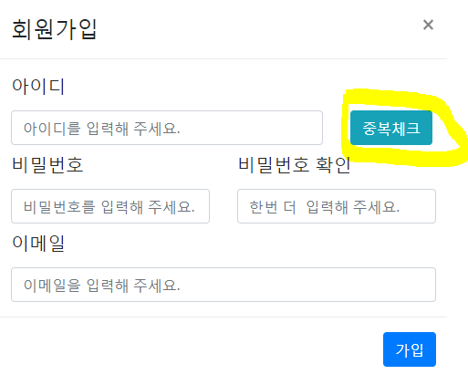
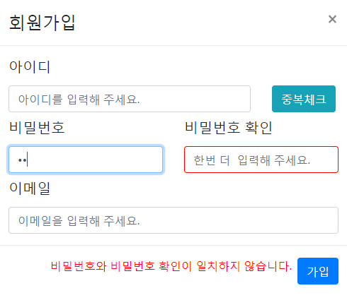
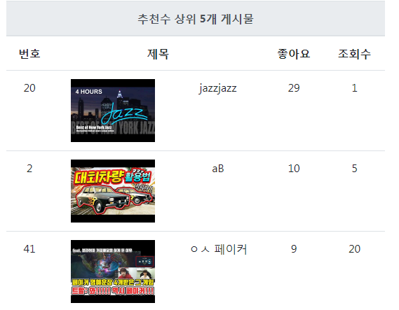

# 코드 리뷰
(소스 분석 문서, 윤다형)

# 목차
[TOC]

***
## 들어가며
* 본 분석 문서는 전체 소스를 다루고 있지 않습니다. 수업시간에 반복적으로 학습했던 것 외에 개인적으로 처음 시도 했던 코딩 방식 위주로 설명했습니다.
* 설명의 순서는 가급적 실제 사용자의 행동 순서를 따랐습니다.
 
***
## 1 회원 가입(navbarTemplate.jsp)
 회원 가입 폼은 bootstrap의 'modal'방식으로 구현했습니다. 회원 가입 폼의 데이터에 대한 검증을 Client Side에서 1차적으로 검증 한 후, Server Side에서 2차로 검증 합니다.
  이 같이 검증 절차를 설계한 목적은 잘못된 데이터가 입력 되었을 때 오류 상황이 생기지 않게끔 하는 것이었습니다. 최종적으로 DB 에서 Constraint에 걸리기 때문에 잘못된 데이터가 들어갈 수는 없지만 반응 경로가 예상할 수 없는 범위가 되어, 제어하기가 어려워지기 때문입니다.
 
### 2-1 아이디 중복 체크

 중복 체크를 위한 스크립트는 아래와 같습니다.
**navbarTemplate.jsp**
```javascript
	/* 중복 체크를 위한 변수 선언*/
    var overlap = 0; // 0  중복체크 안함, 1 중복 체크 완료 및 중복 없음
    
    /* 아이디 중복체크 */
	function idCheck() {
		var id = document.getElementById("joinId");
		
        // 1) input value 검증
		if(id.value == ""){
			console.log("null if문 실행")
			alert('id를 입력해주세요');
			return;
		} else if(id.value.match(/[가-힣ㄱ-ㅎㅏ-ㅣ]/)) { // 한글을 걸러내기 위한 정규식
			alert('아이디는 한글을 제외해 주세요.');
			return;
		}
	
		// 2) 검증된 데이터를 서버에 전송, ajax 방식
 		var req = new XMLHttpRequest();
		req.onreadystatechange = function() {
			if(this.readyState == 4 && this.status == 200) {
				var out = JSON.parse(this.responseText);
				if(out.result == "yes") {
					alert('아이디가 존재합니다.');
				} else {
					alert('사용 가능한 아이디 입니다.');
					overlap = 1; // 중복체크 완료
					var checkbutton = document.getElementById("checkButton");
					checkbutton.className += " disabled";
					id.disabled = true;
					console.log('버튼 비활성화 완료');
					document.getElementById("tempId").value = id.value;
				}
			}
		}
		req.open("GET","./idOverlapCheck.kly?check="+id.value, true);
		req.send();
	}
```

 이 함수는 아래 그림<1-1-1> 의 중복 체크 버튼을 누르면 onclick 이벤트로 발생하게 됩니다.
 
 
 
 ==<그림 1-1-1>==
 
 이때 아이디(input 태그)에 값을 넣으면 1)부분에 의해 1차로 데이터를 검증합니다. 두번째 else if 문에서는 정규식을 사용해 한글을 걸러 내는 작업을 했습니다.
 
 1)에서 무리없이 데이터가 통과 되면, 2)에서 데이터베이스로 연결됩니다. `this.responstText`는 현재 `{"result":"yes"}`형태로 들어오게 되어 있습니다. 중복 값이 없을 경우 value는 no로 나오게 됩니다. 따라서 `out.result`의 값을 통해 중복 상황을 알 수 있습니다.
 
 데이터베이스에 접속하는 방식은 일반적인 Controller-command 방식을 따라 진행되므로 설명을 생략합니다.


### 2-2 비밀번호 알림
 비밀번호 체크를 위한 스크립트는 아래와 같습니다. 이때 `#pass1`과 `#pass2`를 id 값으로 갖는 `input`태그에서는 `onkeyup="passCheck()"`과 같은 이벤트를 줌으로써, 아래의 스크립트가 계속 실행 되게 됩니다.

**navbarTemplate.jsp**
```javascript
	var passConfirm = 0; // 패스워드 일치 시 1
    
    /* 패스워드 일치 알림 */
	function passCheck() {
		var pass1 = $("#pass1").val();
		var pass2 = $("#pass2").val();
		if(pass1 != pass2) {
			$("#passCheckMessage").html("비밀번호와 비밀번호 확인이 일치하지 않습니다.");
			$("#pass1").addClass("warn");
			$("#pass2").addClass("warn")
		} else {
			$("#passCheckMessage").html("");
			$("#pass1").removeClass("warn");
			$("#pass2").removeClass("warn");
			 passConfirm = 1;
		}
	}
```
`warn`클래스 값은 아래와 같이 스타일을 주었습니다.
**navbarTemplate.jsp**
```css
	.warn {
		border : 1px red solid;
	}
```
 이 부분은 jQurey를 이용했는데, 두 입력 값이 일치하지 않을 경우 클래스 속성을 추가하고, 일치할 경우 클래스 속성을 제거하는 방식으로 사용자가 비밀번호 일치여부를 알 수 있게끔 했습니다. 결과는 아래 그림<1-2-1>과 같습니다. 참고로, `passConfirm`이라는 변수는 `form` 제출시 비밀번호 검증 여부를 확인하고 제출할 수 있도록 만들어 준 변수 입니다.
 
 
 ==<그림 1-2-1>==
 
***
## 2 이메일 인증
 회원 가입 후에는 자동으로 이메일 인증을 하게끔 구현했습니다. 이때 보내지는 메일의 간략한 소스는 아래와 같습니다.

**EmailAuthAction.java**
```java
	memberID = (String) session.getAttribute("memberID");
    EmailAuthService eas = new EmailAuthService();
    String to = eas.getUserEmail(memberID); // 유저의 가입 이메일 가져오기.
    
    String subject = "KLY 회원 인증 이메일 입니다.";
	String content = "다음 링크에 접속하여 인증을 진행하세요."+
					"<a href='" + host + "emailCheckedAction.kly?code=" + new SHA256().getSHA256(to) + "'>이메일 인증하기</a>"; 
    (중략)
    
    MimeMessage msg = new MimeMessage(ses);
	msg.setSubject(subject);
```

 가입 시, session에 id 값을 준 상태이므로 이를 불러와서 사용했습니다. 이 소스의 주요한 부분은 `<a>`링크 부분입니다. id 값을 통해서 얻은 해쉬를 `code`라는 파라미터로 보내고 있습니다. 이때의 이 해쉬 값이, **EmailCheckedAction.java**에서 다시 해당 아이디의 이메일 값으로 불러온 해쉬와 일치한다면 인증에 성공하는 것입니다.
  **EmailCheckedAction.java**에서 인증 절차의 간략한 소스는 아래와 같습니다.
 
 **EmailCheckedAction.java**
 ```java
 	(중략)
    code = request.getParameter("code");
    boolean isRight = (new SHA256().getSHA256(memberEmail).equals(code)) ? true : false;
 ```
 
 이를 통해 DB의 컬럼에서 인증여부를 체크 합니다. 이 역할을 맡는 컬럼은 MEMBER 테이블의 'MEMBER_CHECKED'입니다. 이 컬럼에 해당하는 튜플의 값이 1이면 인증이 된 것으로, 0이면 인증이 되지 않은 것으로 판단할 수 있습니다.
 
*** 
## 3 메인 페이지 게시물 리스트
 메인 페이지에서 바로 조회 수와 추천 수가 가장 높은 게시물 3개씩을 볼 수 있도록 구현했습니다. 그 중 최고 조회 수 게시물 리스트를 불러오는 스크립트를 살펴보겠습니다.
**index.jsp**
```javascript
	function aws() {
			var req = new XMLHttpRequest();
			req.onreadystatechange = function() {
				if(this.readyState == 4 && this.status == 200) {
					var arr = JSON.parse(this.responseText);
					var out =
						"<tr>" +
							"<td>" + arr.value0[0] + "</td>"+
							"<td><a href=\"./boardList.kly\"></a></td>"+
							"<td>" + arr.value0[2] + "</td>"+
							"<td>" + arr.value0[3] + "</td>"+
							"<td>" + arr.value0[4] + "</td>"+
						"</tr>" +
						"<tr>" +
							"<td>" + arr.value1[0] + "</td>"+
							"<td><a href=\"./boardList.kly\"></a></td>"+
							"<td>" + arr.value1[2] + "</td>"+
							"<td>" + arr.value1[3] + "</td>"+
							"<td>" + arr.value1[4] + "</td>"+
						"</tr>" +
						"<tr>" +
							"<td>" + arr.value2[0] + "</td>"+
							"<td><a href=\"./boardList.kly\"></a></td>"+
							"<td>" + arr.value2[2] + "</td>"+
							"<td>" + arr.value2[3] + "</td>"+
							"<td>" + arr.value2[4] + "</td>"+
						"</tr>";
					}
					document.getElementById("topReadcountList").innerHTML = out; //topReadcountList는 tbody
				}
			req.open("GET","./indexTopList.kly", true);
			req.send();
		}
```
 이 소스는 앞서 살펴본 아이디 중복 체크 소스와 거의 같습니다. 다른 점을 굳이 찾아면 JSON 형태의 데이터를 조금 더 JSON 같이 활용했다는 것인데요. table 소스는 직관적으로 이해할 수 있는 형태이니 여기에 어떻게 값을 넣었는지 살펴 보겠습니다. 아래의 **IndexTopListAjax.java** 클래스는 Action의 역할을 하는 클래스 입니다.
 
**IndexTopListAjax.java**
```java
	StringBuffer result = new StringBuffer("");
	result.append("{");
		// topReadcountList를 JSON 형태로 변환
		for(int i=0; i<topReadcountList.size(); i++) {
			if(i == topReadcountList.size()-1) {
				result.append("\"value"+ i +"\":"
						+ "[\"" + topReadcountList.get(i).getBOARD_NUM() +"\","
						+ "\"https://img.youtube.com/vi/"+topReadcountList.get(i).getBOARD_YOUTUBE_ID()+"/0.jpg\","
						+ "\"" + topReadcountList.get(i).getBOARD_SUBJECT() +"\","
						+ "\"" + topReadcountList.get(i).getBOARD_LIKECOUNT() +"\","
						+ "\"" + topReadcountList.get(i).getBOARD_READCOUNT() +"\"]"
						);
			} else {
				result.append("\"value"+ i +"\":"
						+ "[\"" + topReadcountList.get(i).getBOARD_NUM() +"\","
						+ "\"https://img.youtube.com/vi/"+topReadcountList.get(i).getBOARD_YOUTUBE_ID()+"/0.jpg\","
						+ "\"" + topReadcountList.get(i).getBOARD_SUBJECT() +"\","
						+ "\"" + topReadcountList.get(i).getBOARD_LIKECOUNT() +"\","
						+ "\"" + topReadcountList.get(i).getBOARD_READCOUNT() +"\"], "
						);
			}
		}
		result.append("}");
```
 이 클래스에서 게시물 데이터를 BoardBean타입의 ArrayList 형태로 가져온 다음, StringBuffer에 하나하나 끼워 넣어 결과적으로 JSON 형태의 text가 되게끔 만들었습니다. 이렇게 반환된 String 값은 이전의 소스에서 보듯이 다시 테이블에 하나씩 끼워져 실제 사용자에게는 아래와 같이 보이게 됩니다.


==<그림 3-1>==

***
## 4 게시물 관련(List.jsp)
 
### 4-1 게시물 열기/닫기 + 조회 수
 저희 팀은 게시물 페이지에서 바로 영상을 재생하는 식으로 게시물 조회 방식을 구현했습니다.
 팀원이 패널 형식으로 구현한 게시물 뷰에서, 여러개의 게시물을 클릭할 경우 누적해서 패널 폼이 열리게 되는 현상이 발생했습니다.
 팀원이 게시물 뷰를 구현한 방식은 이미 존재하는 div 태그의 diplay 속성을 변경하는 방식이었습니다. 이를 해결하는 방식으로 기존에 'onclick="document.getElementById("id").style.display="none"' 형태로 존재하던 클릭 이벤트를 자바스크립트 함수로 교체했습니다. 그렇게 함으로써 동시에, 그전까지 겪고 있던 조회 수 증가에 대한 문제도 해결할 수 있었습니다.
 
 이 문제를 해결한 스크립트는 아래와 같습니다.
 
```javascript
	var view = null;
	
	function viewCount(id, boardNum) {
		// 1) 게시물 클릭 시, 열려있는 게시물 닫기
		if(view == null) { // 처음 클릭하는 게시물의 경우
			var content = document.getElementById(id);
			content.style.display = 'block';
			view = id;
		} else {
			var content = document.getElementById(id);
			content.style.display = 'block';
			var activeContent = document.getElementById(view);
			activeContent.style.display='none';
			view = id;
		}
		content.scrollIntoView();
		
		// 2) 조회 수 증가
		var req = new XMLHttpRequest();
		req.onreadystatechange = function () {
			if(this.state == 4 && this.status == 200) {
				var result = JSON.parse(responseText);
				console.log("조회 수 증가 결과 : "+result.result);
			}
		}
		
		req.open("GET","./viewCount.kly?boardNum="+boardNum, true);
		req.send();
	}
```

 onclick 이벤트를 위의 `viewCount(id,boardNum)` 함수로 변경한 것이 문제 해결의 전부입니다. view 변수는 `div`의 고유 id 값을 담는 변수 입니다. 이를 통해 계속해서 열려 있던 게시물(즉, `div`의 `style`이 `block` 이던 게시물)을 클릭할 때마다 닫을 수 있게 되었습니다.
 이 때, 두번째 매개 변수인 boardNum(게시물 번호)를 통해서 해당 게시물의 조회 수 증가를 같이 구현했습니다. 이 부분은 여태까지 ajax를 사용한 방식과 동일합니다.